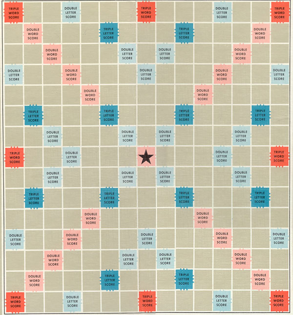
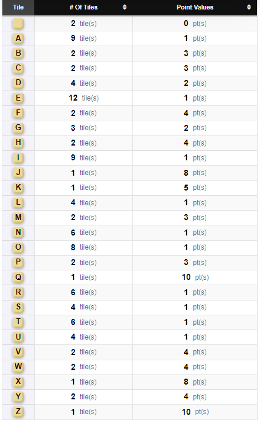

# Coding Challenge  # 9

## The Goal

We want to be able to create our own scrabble bot!

Here is a scrabble board.

Here is the list of tiles and letter scores in a game of scrabble.

Now for the first part of this challenge, we want to be able to execute two functions.

### Function 1 - Draw

Select 7 random tiles from the list of tiles available. We should be able to do this for multiple players and remove them from the 'bag' once drawn.

### Function 2 - LetterScore

We should be able to specify a board position and a tile. The result will be the value of the tile with any multiplier applied.
